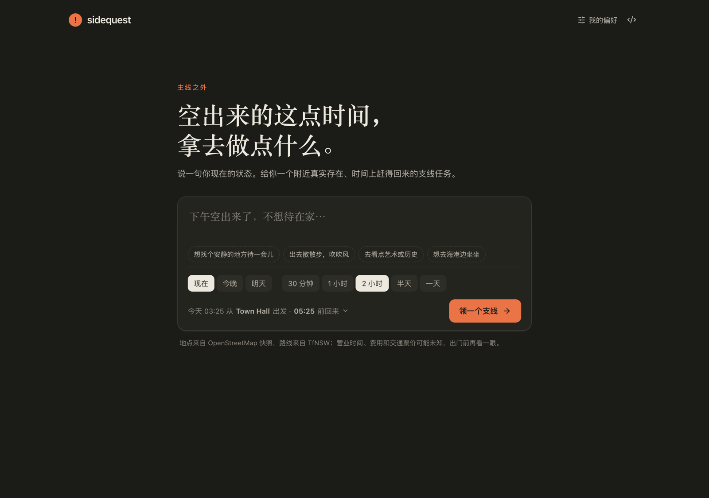
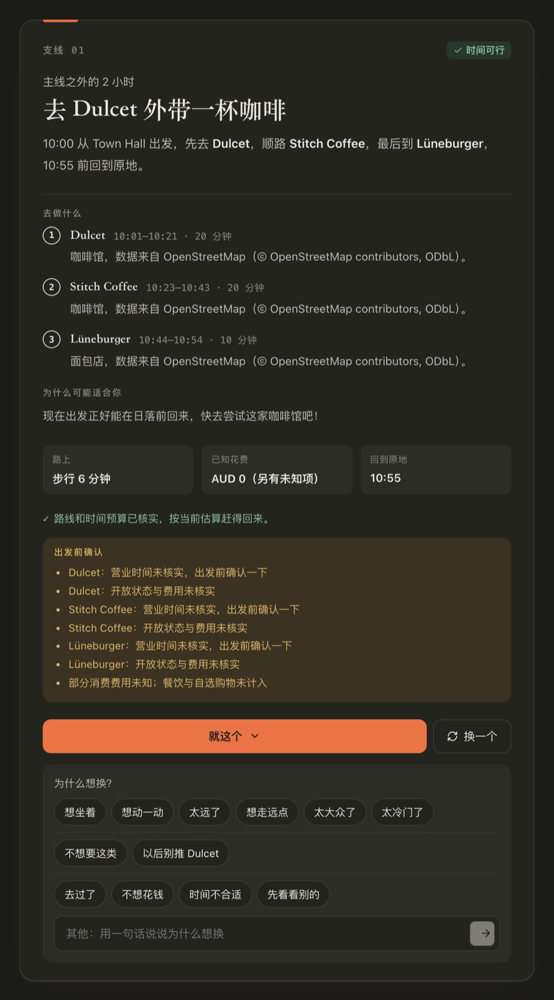
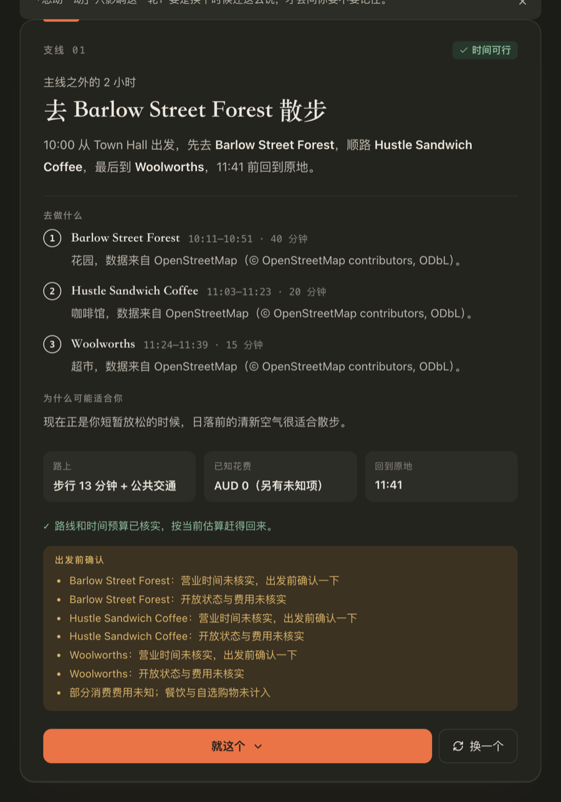
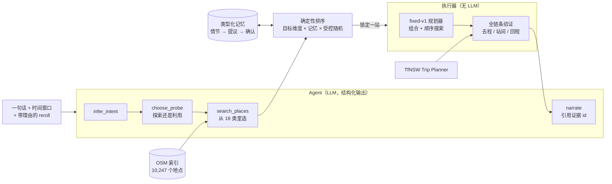
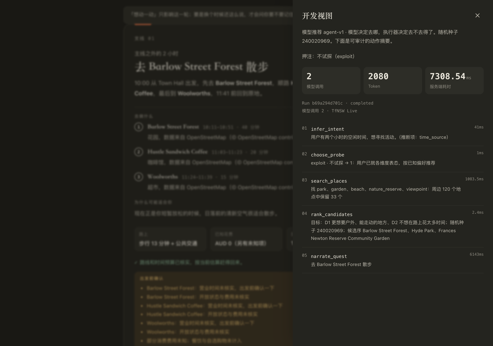
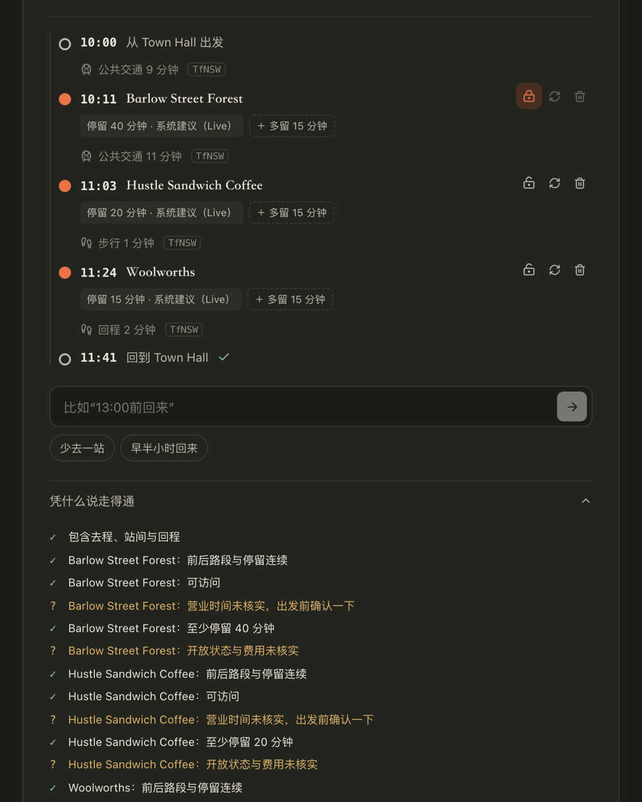

# Sidequest

[](https://github.com/Cheryl-29/sidequest/actions/workflows/ci.yml)

**一个会从“换一个”里学习你口味的支线任务 Agent。** 说一句现在的状态、给一段空闲时间，它在出发地周边的真实地点里挑一个去得到、赶得回来的小任务；不喜欢就换，并告诉它为什么——换着换着，它越来越懂你。目前只覆盖**悉尼**。

> 悉尼 · OpenStreetMap 地点快照 · TfNSW 实时公交路线 · OpenAI 结构化输出 · FastAPI + React/TypeScript

| 一句话 + 一段时间 | 带理由地换一个 | 换完之后 |
|---|---|---|
|  |  |  |

上面三张是真实运行截图：第一次给了咖啡馆，点“想动一动”之后，Agent 把目标改成户外，选中了一片城市林地，并用 TfNSW 查过往返路线，保证赶得回来。

---

## 这是什么？

会议取消了，或者周六下午突然没事，你多出来两个小时，想出门做点什么，但是：

- **地图 App** 默认你已经知道自己要什么（“附近的咖啡馆”）。
- **行程规划工具** 要你先定目的地、定一整天，还要填一堆信息。
- **聊天机器人** 很乐意推荐一个一小时前就关门的展馆，或者一个去了就赶不回来的地方。

Sidequest 做的就是这块空白：在你附近推荐**一个**具体的小任务，比如“去 Barlow Street Forest 散步，顺路买个三明治，11:41 前回到原地”。它有两个承诺：

1. **一定赶得回来。** 去程、站间、回程每一段都用真实公交数据核过，可不可行永远不由模型说了算。
2. **越用越不泛泛。** “换一个”不会白换。“太安静了”“想坐着”“不想要这类”都是有类型的信号，会直接改变下一次推荐；经你确认后，还会变成长期偏好，并且只在对应的情境里生效，比如工作日午休或周末下午。

**范围：目前只支持悉尼。** 地点来自悉尼范围的 OpenStreetMap 快照，路线来自新州交通局（TfNSW）的公开接口，出发点坐标也限制在悉尼范围内，时间统一按悉尼时区处理。换成别的城市，需要换地点快照和路线数据源，并把时区和坐标范围改成可配置；验证、记忆和评测的逻辑本身不依赖悉尼。

### 一次典型的使用

1. 输入“下午空出来了，不想待在家”，选 2 小时，从 Town Hall 出发。
2. Agent 推断你的意图，决定这一轮是**探索**（试探一个还不了解的口味维度）还是**利用**（用已知的偏好），然后在去得到的范围里检索真实地点。
3. 确定性的执行器安排站点、核对每一段路线，返回一张任务卡：路线、已核实的部分，以及出发前需要确认的事项（比如营业时间未核实）。
4. 你点“换一个”，理由选“想动一动”。下一个任务偏向户外——不是随机换，而是这个理由移动了一个具体的口味维度。
5. 几次不同的会话里给出同方向的反馈后，它会问：“要不要记住你工作日午休偏好户外？”确认之后，下次第一个推荐就更对味。它记住的每一条都能在偏好抽屉里看到，也都能删掉。

## 核心设计：模型决定去哪，执行器决定去不去得了



- **LLM 永远不产出时间、费用和可行性结论。** 模型只输出受 JSON Schema 约束的意图、试探维度和地点类别；候选必须来自检索结果，被选中的地点作为“锁定站点”交给确定性规划器。模型回复再差，结果也只是“无聊”，不会是“去不了”。
- **验证是全链条的。** 每个 `Check` 是 `pass | fail | unknown`：任何 `fail` ⇒ `infeasible`，任何 `unknown` ⇒ `conditional`，只有全部 `pass` 才是 `verified`。单个地点各自可达，不代表连起来赶得回来。
- **缺失的事实保持缺失。** 缺营业时间不会被默认成“开着”，缺票价不会被当成 0，而是作为“出发前确认”列给用户看。

## 技术亮点

**1. 反馈驱动的类型化记忆（主亮点）**
- 每次“换一个”都必须带一个类型化理由，理由分 7 个作用域，互不混用（导入时 `assert` 检查完整划分）：移动口味维度、一次性局部调整、类别偏好、用户明示、硬约束、仅去重、仅本会话。例如“去过了”不表达任何口味，用户可能正是因为喜欢才去过。
- 记忆条目分 `dimension / category / place / note` 四类，可以绑定由请求时间自动推出的**情境**（午休、下班后、周末 × 窗口长短），不需要问用户，也不由模型命名。
- 管理流程可审计：情节记录 → 规则合并 → 服务端提议 → 用户确认 → 冲突裁决 → 召回 → 删除级联。只有 `confirm()` 能写入长期记忆；同一情境的支持数达到阈值、跨 ≥2 个会话且没有反例才会提议；其他情境里的反例不算反例；记忆加分有上限，不能压过用户当下说的话。

**2. 探索与利用**
- `choose_probe` 决定这一轮是试探某个口味维度，还是利用已知偏好；可以试探的维度由闸门脚本（`check_dimensions.py`）在真实候选池上验证覆盖率和两极分布后才会启用。
- 随机性放在执行器里，而不是模型温度：在分数与最佳相差不超过一次维度命中的前 5 名里做带种子的加权抽样，种子写进 Trace，评测时固定种子。

**3. 可靠性工程**
- 异步任务 + SSE 逐步推送 Agent 进度；SQLite 文档存储上的 compare-and-swap 保证已取消或已被取代的请求，不会被迟到的结果覆盖；服务重启时，未完成的任务标记为 `interrupted`。
- 模型错误、45 s 超时，或押注的地点全部验证失败时，自动降级到固定策略，并在界面上说明原因。
- 路线缓存键包含精确出发时刻；API Key 只放在 Header 里，不进 URL、日志或缓存；用户输入不参与拼接 URL，并有专门的提示注入测试。
- 叙述里引用的证据 id 会和真实证据核对，编造的 id 直接丢弃；没有已确认记忆支撑时，“你说过 / 你喜欢”这类话由执行器删掉（这是真实模型实测时发现的问题）。

**4. 评测体系**：冻结场景回归、暴力参考规划器、模拟用户跨会话实验，详见下一节。

## 评测

三层评测，全部可以离线复现，报告在 [`reports/`](reports/) 中，给出原始分子和分母。

### 1. 硬约束回归：`make eval`
24 个冻结场景（16 个开发 + 8 个保留），期望条件写在验证器之外，单独断言。**24/24 通过**，在 CI 中运行。

### 2. 搜索召回：`scripts/check_reference.py`
暴力参考规划器穷举所有“组合 × 顺序”，用来衡量固定规划器有没有漏掉可行解：有可行解的 22 个场景里，**规划器全部命中（22/22），有 verified 解的 21 个场景也全部拿到 verified（21/21）**，没有漏报，也没有判定分歧。

### 3. 模拟用户跨会话实验：`scripts/run_personas.py`
12 个合成 persona，每个带有对 Agent 隐藏的口味（D1 室内/户外、D2 远/近、类别好恶、情境规则、拉黑地点），判官是确定性的。每个 persona 依次进行多次会话，会话之间只保留记忆。六组对照只改变“允许存什么”，不改产品代码。

开发集 persona（7 个 persona、44 个会话、完整 OSM 索引、gpt-4o-mini，固定种子下重复 3 次，报告 [r1](reports/personas-openai-r1.json) · [r2](reports/personas-openai-r2.json) · [r3](reports/personas-openai-r3.json)）：

| 组 | 首轮接受 | 3 轮内接受 | 提议被接受 | 记忆召回 |
|---|---:|---:|---:|---:|
| 固定策略（不解读理由） | 25/44 | 29/44 | — | — |
| Agent · 无长期记忆 | 22–23/44 | **44/44** | — | 0/11 |
| Agent · 扁平维度画像 | 34/44 | 44/44 | 6/12 | 6/11 |
| **Agent · 类型化 + 情境记忆**（上线方案） | **34/44** | **44/44** | **5/5** | 5/11 |

读法：
- **会收敛**：固定策略被拒之后几乎不再收敛（3 轮内 29/44）；读取理由的 Agent 3 轮内全部被接受（44/44）。
- **会记住**：有长期记忆时，首轮接受率从 22–23/44 提升到 34/44。
- **记得准**：情境化记忆的提议全部被 persona 接受（5/5），扁平画像有一半被拒（6/12）。44 个会话共 201 次模型调用，约 14.7 万 token。
- 这个实验暴露并修掉了一个产品 bug：`search_places` 的类别过滤曾把户外地点全部删掉，导致偏户外的 persona 连说五次“想动一动”，拿到的仍是五家奶茶店。现在由执行器在过滤删光用户要的东西时补回（`keep_what_the_user_asked_for`）。

保留集 persona（5 个 persona、30 个会话，从未参与开发与调参；配置冻结在 `0bb454e` 后运行，gpt-4o-mini 重复 3 次，报告 [r1](reports/holdout-openai-r1.json) · [r2](reports/holdout-openai-r2.json) · [r3](reports/holdout-openai-r3.json)）：

| 组 | 首轮接受 | 3 轮内接受 | 提议被接受 | 记忆召回 |
|---|---:|---:|---:|---:|
| 固定策略（不解读理由） | 9/30 | 9/30 | — | — |
| Agent · 无长期记忆 | 8–9/30 | **24/30** | — | 0/23 |
| Agent · 扁平维度画像 | 15/30 | 24/30 | 4/7 | 4/23 |
| **Agent · 类型化 + 情境记忆**（上线方案） | **16/30** | **24/30** | **8/8** | 8/23 |

读法：
- **结论在没见过的 persona 上成立**：记忆组首轮接受约是无记忆组的两倍，情境化记忆的提议 3 次全部被接受（扁平画像 4/7）。3 轮内没被接受的 6 个会话全部来自 p12（18 个类别全都讨厌），产品目前没有“怎么都不合适”时的收场路径。
- **情境条件的直接证据**：p08 只在午休想走动，只有类型化 + 情境记忆学会了这条规则并在之后的午休首轮用上；两个不分情境的组提出的条目被拒，午休首轮始终没用上记忆。
- **一个有意为之的盲区**：p09 每次都说“想出去走走”，其实想坐。记忆确认了“想坐”，但“用户这次说的”优先于记忆，3 次重复里记忆只左右了 1 个首轮。
- 召回分母 23 里有 18 条是 p12 讨厌的类别；去掉 p12，类型化 + 情境记忆召回 4/5。

> 边界：persona 是合成的，不代表真实用户；判官与 Agent 共用同一套维度定义，测的是记忆与排序机制，不是维度本身是否贴合真人。3 次重复中开发集三个记忆组逐项相同，保留集首轮接受各组相差至多 3 个会话；执行器的抽样种子是固定的，重复只覆盖模型采样的波动，不覆盖种子。保留集已经看过，之后若再改阈值或排序，它就不再是保留集。确定性的 `RuleModel` 替身（无网络、无模型）可以随时复现同一套机制：开发集 `typed_context` 首轮接受 28/44、提议 6/6；保留集 15/30、提议 8/8（[报告](reports/holdout-rule.json)）。

## 快速开始

需要 Python 3.12+、Node.js 20+。

```bash
make install       # venv + 后端依赖 + 前端依赖
make places-demo   # 用仓库内的 OSM 探针快照离线构建小索引（157 个地点）
make run           # 构建前端并启动服务
```

打开 <http://127.0.0.1:8000>。不配置任何 Key 时，路线使用合成回放、策略使用固定规划器，全程不需要联网。

想启用真实路线和 Agent，在项目根目录的 `.env` 中写入：

```bash
TFNSW_API_KEY=...     # Live 公交路线
OPENAI_API_KEY=...    # Agent 策略（可选 OPENAI_MODEL / OPENAI_BASE_URL）
```

完整的悉尼索引（10,247 个地点）需要先运行 `scripts/fetch_places.py` 抓取 Overpass 快照，再用 `scripts/build_places.py` 构建；`make places-demo` 不会覆盖已有的索引。

验证（与 CI 一致）：

```bash
make test         # ruff + pytest（200 项）+ 前端类型检查与构建
make eval         # 24 个冻结场景
make dimensions   # 口味维度闸门
```

在终端里直接驱动 Agent（会调用真实模型）：

```bash
PYTHONPATH=backend .venv/bin/python scripts/run_agent.py --say "下午空出来了" --hours 3 --reroll too_obvious
```

## 代码结构

```text
backend/sidequest/      FastAPI 后端，约 5k 行
  agent.py              Agent 一轮：意图 → 试探 → 搜索 → 排序 → 锁定 → 叙述
  llm.py                OpenAI JSON Schema 结构化输出适配器（httpx，无 SDK，调用预算，类型化错误）
  planner.py            fixed-v1 规划器与全链条验证器
  providers.py          TfNSW 路线适配器、Live 工具
  places.py             OSM 地点索引、半径检索、分环配额、营业时间软排除
  taste.py / memory.py  反馈作用域、证据规则；类型化记忆、情境、提议与删除级联
  moment.py             “为什么是现在”的可引用事实（日落、时间窗口、路段）
  api.py / storage.py   异步任务、SSE、reroll/accept/偏好 API；owner 隔离的 SQLite 文档存储
  personas.py / harness.py / reference.py   模拟用户、跨会话实验、暴力参考规划器
backend/tests/          200 项测试，约 2.3k 行
frontend/src/           React + TypeScript 单页（输入 → 任务卡 → 换一个 → 偏好抽屉 / 开发视图）
evals/                  冻结场景与 persona 定义
reports/                评测产物
docs/                   架构说明、数据可行性探针记录
```

## 开发视图

每一轮都能看到 Agent 押注了什么、调用了几次模型、用了多少 token，以及每一步的耗时；行程详情页列出每一项检查及其依据。

| 可审计的动作 Trace | 时间线与“凭什么说走得通” |
|---|---|
|  |  |

## 诚实边界

- 营业时间目前只作提示，不参与判定（`venue_facts="advisory"`）：OSM 的 `opening_hours` 不可靠，已知的关门时间仍会判定失败。
- 地点描述只来自 OSM 标签，所以叙述会偏平淡；地点的当期内容（展览等）是计划中的 RAG 切入点，还没有实现。
- 身份是随机会话 Cookie，没有账号体系；清掉 Cookie 就会失去记忆。
- 仅限悉尼范围；公交票价缺失时显示为未知，不按 0 计算。

## 文档

- [`docs/architecture.md`](docs/architecture.md)：请求生命周期、Agent 边界、记忆规则、证据与缓存
- [`docs/data-feasibility.md`](docs/data-feasibility.md)：M0 真实数据探针与许可
- [`Sidequest_项目计划_v2.md`](Sidequest_项目计划_v2.md)：产品定位、研究问题、实验记录与取舍

## 数据来源

地点数据 © OpenStreetMap contributors，遵循 [ODbL](https://opendatacommons.org/licenses/odbl/) 许可；路线数据来自 Transport for NSW Open Data Hub。
